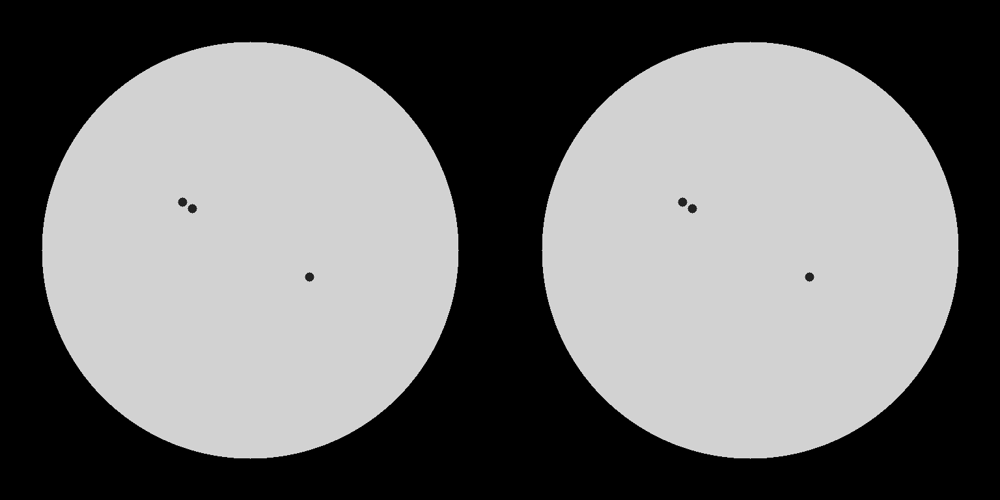

# Solar Insight — 太陽可視光画像解析とフレア推論の研究プロトタイプ

可視光の太陽全面画像から黒点候補と群候補を検出し、比較画像・CSV・JSONを生成するPythonプロジェクトです。観測時にHα拡大撮影の判断材料を得ることを目標に開発してきました。画像と数値特徴量を結合するフレアモデルの推論コードも整理しています。

**現在確認できている機能は、合成画像と提供された実観測画像1枚での画像解析です。将来のフレアを予測する性能は未検証です。** 公開前の確認用として整理した初版です。

## デモ



上の画像は動作確認用の合成画像です。実観測での検出精度の証拠ではありません。

## 実行

Python 3.11以上を使用します。プロジェクトフォルダで実行してください。

```sh
python -m venv .venv
# Windowsのコマンドプロンプト: .venv\Scripts\activate.bat
# macOS/Linux: source .venv/bin/activate
python -m pip install -e .
solar-insight sample_data/synthetic_sun.png --output-dir outputs
python -m unittest discover -s tests
```

実画像も同じコマンドで渡せます。ファイル名に撮影日時がなくても解析できます。検出前後の比較PNG、黒点候補の座標CSV、群数・候補数・相対数のJSONを出力します。

## 実観測画像での実行確認

```sh
solar-insight sample_data/20250430140810.png --output-dir outputs
```


| 処理 | 黒点候補 | 群候補 | R |
|---|---:|---:|---:|
| 提供された旧出力・旧検出関数の再実行 | 22 | 10 | 122 |
| 外縁マスク修正後 | 20 | 8 | 100 |

旧処理の2候補は、左右の太陽縁に沿う幅269px・高さ741/759pxの輪郭でした。輪郭全体は円周付近に達していても重心だけを判定すると採用されてしまいます。閾値処理後の内側マスクでこれらを除外しました。今回の20候補は正解ラベルで照合しておらず、検出精度や公式黒点数を意味しません。

入力画像 `20250430140810.png` は、作者（hirotonakakita）自身が撮影した太陽可視光画像です。解析例と比較画像はこの入力から生成しています。

## 処理

OpenCVで太陽円を検出 → CLAHE・シャープ化・平滑化 → 適応的閾値と面積条件で暗部候補を抽出 → 80pxの距離条件で群候補を作成 → `R = 10g + s`を計算します。

閾値は旧版を引き継いでおり画像解像度に依存します。本影と半暗部の厳密な識別、Zürich分類、公式の国際黒点数への較正は実装していません。群分けは起点からの距離で判定する旧方式で、連鎖的な近接点を統合しません。結果は目視確認を前提とします。

## 機械学習

ResNet18の画像特徴512次元と、群数・黒点数・相対数の数値特徴64次元を結合し、M発生・X発生・M回数を出力します。添付されたPyTorch学習コードはRGB画像のToTensorのみを使用し、数値は標準化済みCSV列を読み込んでいました。

既存モデルの利用は任意です。

```sh
python -m pip install -e '.[ml]'
solar-insight sample_data/synthetic_sun.png --checkpoint /path/to/flare_model.pth --scaler config/legacy_scaler_recovered.json --allow-legacy-preprocessing
```

合成画像での推論値には天文学的意味はありません。重みは同梱していません。安全な重み読込と厳密な構造チェックを行いますが、今回CPU環境（torch 2.14.0+cpu / torchvision 0.29.0+cpu）でモデル構造の厳密一致と実画像1枚の推論を確認しました。これはモデルの予測性能や元環境の再現を保証しません。復元した標準化はCSVの生値・変換値の対から求めたもので、重み作成時に使われたパラメータだとは確認できていません。出力は未較正のモデルスコアとして表示します。

## 検証と課題

- 合成画像の既知の黒点候補・群数、空画像のエラー、旧群分け方式をテストします。
- 学習ログのX Recall最大0.2609は学習中のデータで算出した値です。未知データの精度としては記載しません。
- 既存データの正解は画像と同じ日のフレア有無です。撮影後の何時間を予測するかが定義されていません。将来予測には撮影時刻と正解期間の再設計が必要です。
- 日付で学習・検証・テストを分け、標準化を学習期間のみで推定し、適合率・再現率・PR-AUC・混同行列で再評価することが次の課題です。
- 自作画像から抽出した数値と、学習CSVの公的観測値が同じ意味・分布かも未検証です。

## ファイル構成

| パス | 内容 |
|---|---|
| `src/solar_insight/` | 解析CLI・検出・モデル・任意の推論 |
| `sample_data/` | 作者撮影の実観測画像と合成サンプル |
| `examples/` | 実行結果の例 |
| `config/` | 旧CSVから復元した標準化パラメータ |
| `tests/` | 動作検証 |
| `docs/` | コード整理の根拠と公開前の確認事項 |

## 出典と開発への関与

元プロジェクトでは自作撮影画像、NAOJ可視光画像・黒点情報、NOAA/GOESのフレア情報などを扱っています。提供された実観測サンプル1枚を同梱しています。大量の画像・元データセット・学習済み重みは含めていません。再配布条件と出典はデータ単位で確認します。

作者が観測上の目的と必要な処理を決め、コーディングはすべてGPTを使用して行いました。主な処理方針・仕様は次のとおりです。

- 黒点と黒点群を検出し、黒点数s・群数gから相対黒点数の指標 `R = 10g + s` を算出・出力する。
- 太陽中心付近と外縁では投影により同じピクセル間隔の意味が異なることを考慮し、黒点を太陽面の緯度・経度へ変換して、黒点間の球面上の中心角で群を判定する構想を定めた。その座標変換と将来の時系列予測への発展を見据え、太陽のP角（自転軸の位置角）と画像方位を扱う処理を求めた。
- 開発途中で検出結果を目視し、解析精度の改善に向けてGPTへ修正を指示した。NAOJの数値との比較・調整を実施した実績としては扱わない。
- 解析結果を観測の判断材料として使えるよう、検出結果の可視化と数値出力を行う。

現在の80pxという群分け条件はGPTの提案を採用したものです。太陽面座標に基づく角距離での群分けは未実現の構想です。座標変換にはP角だけでなく、太陽円の中心・半径、画像の回転・反転やB0角（円盤中心の太陽面緯度）などの確認も必要です。

Rの算出は現在の整理版でも実行できます。P角・方位の処理は旧プロトタイプに含まれますが、計算・画像の向き・時刻系の妥当性を確認する必要があるため、現在の整理版CLIには移植していません。時間変化を扱う将来予測も、現段階で検証済みの機能としては扱っていません。

このように、作者が処理内容と発展方針を定め、GPTを使ってコードを生成したプロジェクトです。このリポジトリへの整理・修正・テスト作成にもGPTを使用しています。

コードの公開ライセンスは、公開前に選定して追加する予定です。

## 既存重みの実行検証

提供された重みはモデル定義にstrict=Trueで読み込めました。復元標準化と実画像（20候補・8群・R=100）でX/Mスコアはともに1.0、M回数の生出力は約366.91でした。スコアの飽和と回数出力の妥当性は未解決です。学習時画像（768×768）とこの実画像の寸法・画質・数値特徴の分布、標準化の由来、同日ラベルとの対応を追加検証します。この実行結果を実用的予測として表示しません。
