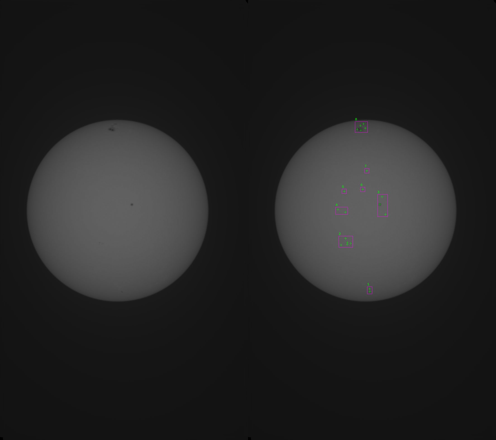
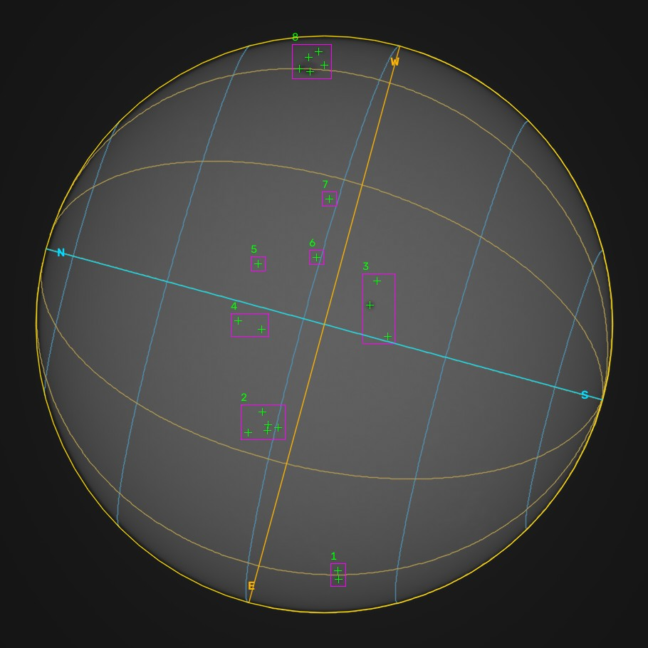

# 黒点解析ツール — 太陽画像解析とフレア予測

太陽の全面画像から**黒点の候補を自動で検出**し、黒点数・群数・相対黒点数（R = 10g + s）を算出するPython製のコマンドラインツールです。
画像1枚とコマンド1つで、**検出結果の比較画像・座標CSV・解析結果JSON**が出力されます。サンプル画像を同梱しているので、インストール後すぐに試せます（Python 3.11以上）。



> 注意：黒点数は画像処理による候補の数で、公式の黒点数ではありません。フレア予測は実験段階で、観測判断に使える精度ではありません。

## クイックスタート

Windowsのコマンドプロンプト：

```bat
python -m venv .venv
.venv\Scripts\activate.bat
python -m pip install -e .
solar-insight sample_data/20250430140810.png --output-dir outputs
```

macOS/Linux：

```sh
python -m venv .venv
source .venv/bin/activate
python -m pip install -e .
solar-insight sample_data/20250430140810.png --output-dir outputs
```

プロジェクトフォルダから実行してください。詳しいオプションは「実行方法」を参照してください。

---

AI・機械学習を用いた太陽フレア予測の研究に関心を持ち、個人の観測環境でも試してみたいと考えました。娘の夏休みの自由研究「Xクラスフレアを観測する」の手伝いをきっかけに、公開観測データでモデルを作り、自分で撮影した太陽画像からフレア発生の予測を試しました。

## 機能

- 可視光の太陽全面画像から太陽円と黒点候補を検出
- 太陽の外周円と、撮影地・時刻から計算した太陽の東西・南北軸を描画
- 太陽面の緯度・経度格子（10／15／30度間隔）を描画
- 黒点候補の群分け、黒点数・群数・相対黒点数の指標 `R = 10g + s` の算出
- 検出前後の比較画像、候補座標CSV、解析結果JSONの出力
- 画像と数値指標を組み合わせたモデルによるM/Xクラスの実験的推論（任意）

画像解析にはOpenCV、予測モデルにはPyTorchを使用しています。モデルはResNet18の画像特徴と、黒点数・群数・Rの数値特徴を結合します。処理方針を決め、コーディングにはすべてGPTを使用しました。

**画像解析は実行できますが、フレア予測は観測判断に使える精度に達していません。モデル出力は未較正のスコアであり、検証済みの発生確率ではありません。**

## 解析例

Seestarで撮影した動画をAutoStakkertでスタッキングし、生成した画像を解析しました。


| 処理 | 黒点候補 | 群候補 | R |
|---|---:|---:|---:|
| 旧処理 | 22 | 10 | 122 |
| 外縁マスク修正後 | 20 | 8 | 100 |

太陽縁の輪郭を黒点として数えていた2候補を除外しました。残りの候補は正解ラベルで照合しておらず、公式黒点数を意味しません。入力画像は自分で撮影したものです。

### 緯度・経度格子を追加したサンプル



四日市市中心部の概算座標（北緯34.965度、東経136.624度）と、元動画の撮影開始時刻（2025-04-30 14:08:10 JST）で計算しました。入力は天頂上・非鏡像として扱っています。黒点数20・群数8・R=100は元の解析と同じです。表示用サンプルは余白を切り抜いたJPEGです。

格子はStonyhurst座標の30度間隔です。青系が緯度線、黄土色が経度線で、明るい水色と橙色の直線は太陽の南北・東西軸です。SunPyで太陽面から観測者の視点へ投影することでB0角による傾きと曲線を反映し、裏側の線を除きます。参照画像との方位一致を定量検証した例ではありません。

```sh
solar-insight sample_data/20250430140810.png --output-dir outputs --observed-at "2025-04-30T14:08:10+09:00" --latitude 34.965 --longitude 136.624 --grid --grid-spacing 30
```

## 実行方法

Python 3.11以上で、プロジェクトフォルダから実行します。仮想環境の作成・有効化は「クイックスタート」のOS別手順を使用してください。

```sh
python -m pip install -e .
solar-insight sample_data/20250430140810.png --output-dir outputs
```

任意の画像パスを指定できます。撮影日時を含むファイル名は必須ではありません。

合成画像での動作確認とテスト：

```sh
solar-insight sample_data/synthetic_sun.png --output-dir outputs
python -m unittest discover -s tests
```

### 天頂が上の画像に方位線を描く

```sh
python -m pip install -e ".[solar]"
solar-insight sample_data/20250430140810.png --output-dir outputs --observed-at "2025-04-30T14:08:10+09:00" --latitude 34.965 --longitude 136.624
```

緯度34.965・経度136.624は四日市市中心部の概算座標です。より正確に合わせる場合は実際の撮影地に置き換えてください。経度は東経が正、緯度は北緯が正です。必要に応じて `--elevation-m` で標高も指定できます。

時刻は撮影日時を指定します。タイムゾーンのない日時はJST（`Asia/Tokyo`）として解釈し、`--timezone` で変更できます。UTCは末尾に `Z`、JSTは `+09:00` を付けて指定できます。動画をスタッキングした画像では、合成後も上が天頂方向であることを確認し、代表時刻（可能なら撮影の中央時刻）を指定してください。開始時刻だけでは、長時間撮影による回転を正確に表せない場合があります。

入力は上が天頂の非鏡像を前提とします。左右反転された画像には `--mirror-x` を付けてください。撮影地と時刻の指定がない場合は外周円だけを描きます。一部だけ指定するとエラーにします。

SunPyの `sun.orientation` で視野の回転とP角を含む太陽北の向きを計算します。P角をさらに加算する必要はありません。南北線は投影された太陽自転軸、東西線はそれに直交する中心通過線です。直線自体は太陽赤道・経緯度格子ではありません。湾曲した太陽面の格子は `--grid` で別途追加します。格子間隔は `--grid-spacing 10`、`15`、`30` から選べます。画像そのものは回転せず、補正した向きの線を重ねます。

比較画像に加えて `*_annotated.png` を保存し、JSONにはUTC時刻、撮影地、P角、B0角、天頂に対する太陽北の角度を記録します。太陽が地平線より下、または天頂に極めて近く方位が定まらない条件はエラーにします。

### 実験的な推論

学習済み重みは同梱していません。既存の重みを利用する場合は、追加依存と数値の標準化設定が必要です。

```sh
python -m pip install -e ".[ml]"
solar-insight sample_data/20250430140810.png --checkpoint /path/to/flare_model.pth --scaler config/legacy_scaler_recovered.json --allow-legacy-preprocessing
```

標準化設定は旧CSVから復元したもので、重み作成時の設定との一致は未確認です。CPUで構造の厳密一致と推論の実行は確認しましたが、X/Mスコアがともに1.0になるなど出力の妥当性は未解決です。

## トラブルシューティング

エラーは端末に表示されます。まず次の点を確認してください。

| 症状・メッセージ | 確認・対処 |
|---|---|
| `Cannot read image: ...` | 画像パス、ファイルの存在、読み取り権限、画像形式を確認します。相対パスはコマンドを実行しているフォルダが基準です。 |
| Windowsで日本語を含むパスの画像が読めない | この環境では未確認です。上のエラーが出る場合は、英数字だけのフォルダ・ファイル名へコピーして、パスが原因か切り分けます。 |
| `Solar axes need observed_at, latitude and longitude together` | `--observed-at`・`--latitude`・`--longitude` を3つとも指定します。方位線が不要なら3つとも外します。 |
| `Heliographic grid needs observation time and observer coordinates` | `--grid` に撮影日時・緯度・経度の3つを追加します。 |
| `Solar axes require: ...`、またはSunPy/Astropyのインポートエラー | 有効な仮想環境で `python -m pip install -e ".[solar]"` を実行します。 |
| `--grid-spacing` の `invalid choice` | 格子間隔は `10`・`15`・`30` のいずれかを指定します。 |
| `Experimental inference needs --scaler and --allow-legacy-preprocessing` | 推論には重みのほかに `--scaler` と `--allow-legacy-preprocessing` が必要です。画像解析だけなら `--checkpoint` を外します。 |
| インストール時にPythonのバージョン不適合と表示される | `python --version` で3.11以上か確認します。古い場合は対応するPythonで仮想環境を作り直します。 |
| `solar-insight` が見つからない／認識されない | 仮想環境を有効化し、同じ環境で `python -m pip install -e .` を実行します。代わりに `python -m solar_insight.cli` に同じ引数を付けても実行できます。 |

## 今後の課題

- **黒点検出・群分け**：現在の閾値と80pxの距離条件は解像度に依存します。閾値の設定ファイル化と、画像サイズに応じた条件の見直しも課題です。本影・半暗部の識別と、正解ラベルによる検出精度の評価が必要です。
- **座標と方位**：外周円と撮影地・時刻に基づく方位線を実装しました。参照画像との実測比較や、長時間スタッキングによる視野回転の確認が必要です。太陽面格子の描画には座標変換を使用していますが、検出した黒点の緯度経度出力と、角距離による群分けは今後の課題です。
- **学習・推論画像の統一**：天文台画像とSeestar画像で、サイズ・明度・画質・数値指標の分布が異なります。残存コードの検出・表示用補正はモデル入力には適用されておらず、前処理の統一が課題です。
- **予測期間の定義**：撮影後24時間以内を想定しましたが、既存モデルは同日の画像とフレア記録を対応させています。撮影前のイベントを含まない正解データの作成が必要です。
- **独立した性能評価**：今回の `train.py` の再現率は学習データ上の値です。日付で学習・検証・テストを分け、標準化を学習期間だけで求め、適合率・再現率などで評価する必要があります。
- **時系列への発展**：SDOの多波長・磁場画像の時間変化とGOESのフレア記録を組み合わせるモデルを構想しました。データ収集・整備と計算負荷を考慮し、現時点では未着手です。

## データ・参考資料

学習には過去約10年の国立天文台の公開画像とNOAAのフレア記録を利用しました。現在確認できる結合CSVは1,651行です。外部の画像・元データセット・論文PDF・学習済み重みは同梱していません。

参考：西塚直人ほか（NICT）「機械学習を用いたリアルタイム太陽フレア予測」、第13回宇宙環境シンポジウム講演論文集、JAXA-SP-16-010、pp.103–106。観測データとフレア記録を使う予測の考え方を参考にしたもので、論文の手法を忠実に再現したものではありません。

方位計算の参考：[SunPy orientation](https://docs.sunpy.org/en/stable/generated/api/sunpy.coordinates.sun.orientation.html)、[SunPy P](https://docs.sunpy.org/en/stable/generated/api/sunpy.coordinates.sun.P.html)。

コード整理と検証の詳細は[レビュー記録](docs/REVIEW.md)にまとめています。

## ライセンス

コード・文書・自分で撮影したサンプル画像・合成画像・解析例は[MIT License](LICENSE)で提供します。改変・転載・再配布・商用利用に事前の相談は不要です。著作権表示と許諾文を残してください。外部の論文・観測データには、それぞれの利用条件が適用されます。
